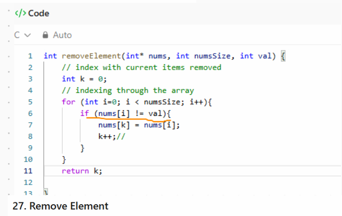

# Sort Analysis Data

## Results Table
Make sure to go out to at least 100,000 (more are welcome), and you have 10 different values (more welcome). You are welcome to go farther, but given 100,000 can take about 20 seconds using a selection sort on a fast desktop computer, and 200,000 took 77 seconds, you start having to wait much longer the more 0s you add. However, to build a clearer line, you will want more data points, and you will find merge and quick are able to handle higher numbers easier (but at a cost you will explore below). 

You are free to write a script to run the program and build your table (then copy that table built into the markdown). If you do that, please include the script into the repo.  Note: merge and quick sorts are going to be explored in the team activity for Module 06. You can start on it now, but welcome to wait.

 

### Table [^note]
| N      | Bubble   | Selection | Insertion | Merge (module 6) | Quick (module 6) |  
| 10     | 0.000001 | 0.000001 | 0.000000 | :--: | :--: |  
| 50     | 0.000011 | 0.000005 | 0.000002  | :--: | :--: |  
| 100    | 0.000026 | 0.000016 | 0.000008 | :--: | :--: |  
| 250    | 0.000145 | 0.000081 | 0.000046 | :--: | :--: |  
| 500    | 0.000556 | 0.000304 | 0.000213 | :--: | :--: |  
| 1000   | 0.002155 | 0.001209 | 0.000665 | :--: | :--: |  
| 2000   | 0.008741 | 0.004563 | 0.002528 | :--: | :--: |  
| 5000   | 0.063351 | 0.028247 | 0.016018 | :--: | :--: |  
| 10000  | 0.283265 | 0.112168 | 0.063926 | :--: | :--: |  
| 20000  | 1.259489 | 0.452660 | 0.304080 | :--: | :--: |  
| 50000  | 8.588222 | 3.006050 | 1.613781 | :--: | :--: |  
| 100000 | 34.361687 | 11.871099 | 7.134020 | :--: | :--: |  

## BigO Analysis  / Questions

### 1. Build a line chart
Build a line chart using your favorite program. Your X axis will be N increasing, and your Y access will be the numbers for each type of sort. This will create something similar to the graph in the instructions, though it won't be as smooth. Due to speed differences, you may need to break up the $O(\log n)$ and $O(n^2)$ into different charts.

### 2. Analysis
Looking at the graph and the table, what can you say about the various sorts? Which are the fastest? Which are the slowest? Which are the most consistent? Which are the least consistent? Use this space to reflect in your own words your observations.  
From both the table and the charts, the gap between the quadratic sorts widens quickly as N grows. Insertion sort is the fastest of the three in my runs, which matches its lower constant factors and the fact it shifts rather than swaps a lot. Bubble sort is the slowest overall and scales the worst, as expected for a comparison heavy O(n²) method with many swaps. Selection sort lands in the middle: it does a fixed pattern of scans and one swap per outer pass, so it’s usually slower than insertion for large N but much better than bubble. In terms of consistency, selection sort is the most stable across input shapes (its work is almost the same whether the data is sorted or not). Insertion and bubble are the least consistent, they can be much faster on nearly sorted arrays (insertion is O(n) and bubble can exit early), but degrade to full O(n²) on harder inputs. Overall, the plots show insertion as the practical winner among these three for moderate sizes, with selection steady but slower, and bubble clearly falling behind as N increases.

### 3. Big O
Build another table that presents the best, worst, and average case for Bubble, Selection, Insertion, Merge, and Quick. You are free to use resources for this, but please reference them if you do. [1],[2],[3]  
| Algorithm    | Best Case   | Average Case   | Worst Case|  
| Bubble       | O(n)*       | O(n2)          | O(n2)     |  
| Selection    | O(n2)       | O(n2)          | O(n2)    |  
| Insertion    | O(n)        | O(n2)          | O(n2)     |  

#### 3.2 Worst Case
Provide example of arrays that generate _worst_ case for Bubble, Selection, Insertion, Merge Sorts  
Bubble Sorts - [10, 9, 8, 7, 6, 5, 4, 3, 2, 1]  
Selection Sort - [10, 9, 8, 7, 6, 5, 4, 3, 2, 1]  
Insertion Sort - [10, 9, 8, 7, 6, 5, 4, 3, 2, 1] 

#### 3.3 Best Case
Provide example of arrays that generate _best_ case for Bubble, Selection, Insertion, Merge Sorts   
For all three - [1, 2, 3, 4, 5, 6, 7, 8, 9]

#### 3.4 Memory Considerations
Order the various sorts based on which take up the most memory when sorting to the least memory. You may have to research this, and include the mathematical notation.  
Bubble O(1) average, worst O(1)    
Selection O(1) average, worst O(1)  
Insertion O(1) average, worst O(1)  
Equal
### 4. Growth of Functions
Give the following values, place them correctly into *six* categories. Use the bullets, and feel free to cut and paste the full LatexMath we used to generate them.  

$n^2$  
$n!$  
$n\log_2n$  
$5n^2+5n$  
$10000$  
$3n$    
$100$  
$2^n$  
$100n$  
$2^{(n-1)}$
#### Categories
* Constant O(1): 100, 10000
* Linear O(n): 3n, 100n 
* Log linear O ($n\log_2n$)
* Quadratic O($n^2$) , $5n^2+5n$
* Exponential O ($2^n$),   $2^{(n-1)}$
* Factorial O(n!): n!

### 5. Growth of Function Language

Pair the following terms with the correct function in the table. 
* Constant, Logarithmic, Linear, Quadratic, Cubic, Exponential, Factorial

| Big $O$     |  Name  |
| ------      | ------ |
| $O(n^3)$    |  Cubic |
| $O(1)$      | Constant  |
| $O(n)$      |  Linear |
| $O(\log_2n)$ |  Logarithmic |
| $O(n^2)$    |  Quadratic |
| $O(n!)$     |  Factorial |
| $O(2^n)$    |  Exponential |

### 6. Stable vs Unstable
Look up stability as it refers to sorting. In your own words, describe one sort that is stable and one sort that isn't stable  
stable example — Insertion sort: In the usual array implementation, when we shift larger elements to the right and then insert the key, equal elements are not swapped past each other, easier to compute so making it more stable.[4]

Unstable example —selection sort repeatedly selects the minimum from the unsorted tail and swaps it with the first position of that tail. That swap can move an equal key from later in the array ahead of an equal key that appeared earlier. A bit harder to compute so making it less stable.[4]

### 6.2 When stability is needed?
Explain in your own words a case in which you will want a stable algorithm over an unstable. Include an example.
It will be way faster and easier to implement as well. The computer won't struggle that much making it more efficient in every aspect. 

### 7. Gold Thief

You are planning a heist to steal a rare coin that weighs 1.0001 ounces. The problem is that the rare coin was mixed with a bunch of counter fit coins. You know the counter fit coins only weight 1.0000 ounce each. There are in total 250 coins.  You have a simple balance scale where the coins can be weighed against each other. Hint: don't think about all the coins at once, but how you can break it up into even(ish) piles.   

If you have 250 and you split it so now you have a pile of 125 and 125 and you know they are all 1.0 ounce each so the pile that is 125.0001 instead of the 125.0000 will have the rare coin. so you basically cut your search in half and you can do it again  and again until find your rare coin. This reminds me of Binary search.

#### 7.1 Algorithm
Describe an algorithm that will help you find the coin. We encourage you to use pseudo-code, but not required.  
If you have 250 and you split it so now you have a pile of 125 and 125 and you know they are all 1.0 ounce each so the pile that is 125.0001 instead of the 125.0000 will have the rare coin. so you basically cut your search in half and you can do it again  and again until find your rare coin. This reminds me of Binary search. 
The algorithm that we will use here will be a binary search algorithm, it will facilitate the search of the rare coin.

#### 7.2 Time Complexity
What is the average time complexity of your algorithm? 
Binary search on a sorted array will have a average time complexity of $O(\log_2n)$ [4]

## Technical Interview Practice Questions

For both these questions, are you are free to use what you did as the last section on the team activities/answered as a group, or you can use a different question.

1. Select one technical interview question (this module or previous) from the [technical interview list](https://github.com/CS5008-khoury/Resources/blob/main/TechInterviewQuestions.md) below and answer it in a few sentences. You can use any resource you like to answer the question.
What is Big O? How does it help us analyze algorithms?  
Big-O notation describes an asymptotic upper bound on how a function—usually an algorithm’s running time or memory—grows with input size n. Formally, f(n) is in O(g(n)) if there exist constants c > 0 and n0 such that for all n ≥ n0, f(n) ≤ c * g(n). In practice, Big-O ignores constant factors and lower-order terms so we focus on the dominant growth rate, which lets us compare algorithms independent of machine or language details. It helps predict scalability (for example, an O(n log n) algorithm will eventually beat an O(n^2) algorithm as n grows), communicate behavior succinctly (e.g., linear search O(n) vs. binary search O(log n)), and guide design choices toward better-growing approaches. [4][8]

2. Select one coding question (this module or previous) from the [coding practice repository](https://github.com/CS5008-khoury/Resources/blob/main/LeetCodePractice.md) and include a c file with that code with your submission. Make sure to add comments on what you learned, and if you compared your solution with others.  
27. 27. Remove Element  

## Deeper Thinking
Sorting algorithms are still being studied today. They often include a statistical analysis of data before sorting. This next question will require some research, as it isn't included in class content. When you call `sort()` or `sorted()` in Python 3.6+, what sort is it using? 

#### Visualize
Find a graphic / visualization (can be a youtube video) that demonstrates the sort in action. 

#### Big O
Give the worst and best case time-complexity, and examples that would generate them. 

## References
Add your references here. A good reference includes an inline citation, such as [1] , and then down in your references section, you include the full details of the reference. Use [ACM Reference format].

1. Cormen, T. H., Leiserson, C. E., Rivest, R. L., & Stein, C. Introduction to Algorithms (3rd ed.). MIT Press — Insertion sort analysis.
2. Sedgewick, R., & Wayne, K. Algorithms (4th ed.), Ch. 2.1–2.2 (Elementary sorts: bubble/selection/insertion).
3. Wikipedia contributors. “Bubble sort”, “Selection sort”, “Insertion sort” — summaries of best/average/worst cases.
4. Thomas H. Cormen, Charles E. Leiserson, Ronald L. Rivest, and Clifford Stein. 2009. Introduction to Algorithms (3rd ed.). MIT Press, Cambridge, MA.  
5. Wikipedia contributors. 2025. “Bubble sort.” Wikipedia, The Free Encyclopedia  Retrieved September 28, 2025 from https://en.wikipedia.org/wiki/Bubble_sort  
6. Wikipedia contributors. 2025. “Selection sort.” Wikipedia, The Free Encyclopedia. Retrieved September 28, 2025 from https://en.wikipedia.org/wiki/Selection_sort  
7. Wikipedia contributors. 2025. “Insertion sort.” Wikipedia, The Free Encyclopedia. Retrieved September 28, 2025 from https://en.wikipedia.org/wiki/Insertion_sort
8. Robert Sedgewick and Kevin Wayne. 2011. Algorithms (4th ed.). Addison-Wesley Professional, Boston, MA.

## Footnotes:
[^note]: You will want at least 10 different N values, probably more to see the curve for Merge and Quick. If bubble, selection, and insertion start to take more than a  minute, you can say $> 60s$ or - . For example 
    | N | Bubble | Selection | Insertion | Merge | Quick |
    | :-- | :--: | :--: | :--: | :--: | :--: |
    | 10,000|0.197758|0.070548|0.000070|0.000513|0.000230|
    |100,000|-|-|-|0.131061|0.018602|

<!-- links moved to bottom for easier reading in plain text (btw, this a comment that doesn't show in the webpage generated-->
[image markdown]: https://docs.github.com/en/get-started/writing-on-github/getting-started-with-writing-and-formatting-on-github/basic-writing-and-formatting-syntax#images

[ACM Reference Format]: https://www.acm.org/publications/authors/reference-formatting
[IEEE]: https://www.ieee.org/content/dam/ieee-org/ieee/web/org/conferences/style_references_manual.pdf